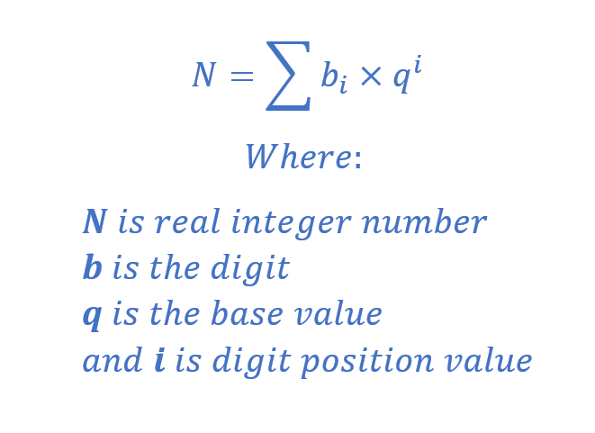

[](https://classroom.github.com/a/ltFgetyx)
# A Number Converting Utility


Until you starting thinking in base-2 or base-16, converting between decimal,
hexadecimal, and binary integer representations is extremely valuable.  The
conversion is easy, but it is tedious.  Is there a way we could automate the
conversion of an decimal integer to hex or binary?

 Your assignment: write a C-program, **convert**, that takes decimal integers
and prints the representation of each value
in either hex or binary.  Your code should be in one file in **convert.c**.

  Which representation should the program print?  Convert takes a single
command-line argument that is either `-x` or `-b`.  Of course `-x` indicates
that the program should print the value in hexadecimal; `-b` indicates that it
should print binary.

## TEST CASES:
```
  $./convert -x 1234
  1234=0x4 d2

  $./convert -x 1234 4321
  1234=0x4 d2
  4321=0x10 e1

  $./convert -b 1234 4321
  1234=100 1101 0010
  4321=1 0000 1110 0001

  $./convert
  Usage: ./convert [-x|-b] num1 [num2 ...]

  $./convert -b
  Usage: ./convert [-x|-b] num1 [num2 ...]

  $./convert -x
  Usage: ./convert [-x|-b] num1 [num2 ...]

  $./convert 1234
  Usage: ./convert [-x|-b] num1 [num2 ...]
 ```
In the examples above, `$` is the Unix command prompt.

As you can see, the output in binary and hex is separated. In binary, each block of 4 digits is separated by a space.
In hex, each block of two digits is separated by a space.

# Command Line Arguments
Unix command line programs like **convert** usually take command line arguments. These are passed into your program
as `argc` and `argv` in `main`:
```
int main(int argc, char* argv[])
```
The `argc` parameter contains the number of command line arguments passed in `argv`.
The `argv` parameter contains an array of strings, one for each command line argument.
The first parameter is always the name of the executable file that is being run, hence
`argc` is always at least 1.

For example, when you run a program like this:
```
./a.out foo bar 123
```
- `argc` is 4
- `argv[0]` is `"./a.out"`
- `argv[1]` is `"foo"`
- `argv[2]` is `"bar"`
- `argv[3]` is `"123"`

# Parsing Command Line Arguments
Parsing and figuring out what to do
with command line arguments is part and parcel of computer systems programming. Luckily there are functions
that help us out with command line parsing. The one you should use is `getopt`. You can find out more about it by
typing
```
 man 3 getopt
```
on the Unix command line, or by following this [link](https://man7.org/linux/man-pages/man3/getopt.3.html).

# Strings to Ints
In C, strings are converted to ints with the `atoi` function. Find out more with
```
 man 3 atoi
```

# Ints to Strings
To convert an int to a string requires taking remainder with the modulo `%` operator, and repeated integer division.
For example, if the int is `678` and you want to convert it to a base 10 string, then
- Initialize an empty string buffer.
- The remainder when `678` is divided by 10 is `8`. Save the character `'8'` in the buffer
- Integer divide `678` by `10`. This gives `67`.
- The remainder when `67` is divided by `10` is `7`. Add the character `'7'` to the buffer.
- Integer divide `67` by `10`. This gives `6`.
- The remainder when `6` is divided by `10` is `6`. Add the character `'6'` to the buffer.
- Integer divide `6` by `10`. This gives `0`, and is the signal to stop the loop.

The buffer contains the string `"876"`. Reverse the characters to get the string `"678"`.

# Useful string functions
In C, taking care to not overflow buffers is a critical skill.
The `snprintf` and `asprintf` functions may be useful in this homework:
```
man 3 asprintf
```

# Usage and Errors
Normally, C programs should print errors to `stderr` and exit with a code other than 0. In our case, this messes up the automated tests which expect
output to `stdout` and a return code of 0. Therefore, make sure you **print all messages to stdout, including the Usage message, and exit with 0**.

# Building and Testing
Write your code in **convert.c**.
Clone the code in this repo to your local machine.
You can either use `git` or download the zip file of this repo, then unzip it on
your local computer.

There is a Makefile included in the repo that allows you to build your program with
```
make
```
Then run your program with `./convert -x 10` for example to convert 10 in decimal to hex.

You can test your code by running
```
make test
```
This executes a series of tests that compare the output of your program with what is expected.
The output must match exactly, including newlines.
The test code can be examined in `test/test_convert.cpp` and is written in C++.
You should be able to read the code even if you don't know C++ as C++ is a close cousin to C.
The tests are exactly the same as those that the autograder tests for.

# Style
It's not enough that our program works correctly. We have to learn to write with proper C style.
This mostly includes indenting properly and leaving spaces at the right places.
Good style means that your code is more understandable and readable by other people.
The autograder includes a **style check** using `cpplint`, which you can also install
on your own computer (both Windows with WSL and MacOS) with
```
sudo pip3 install cpplint
```

cpplint is already installed on the lab computers.

Run cpplint over your own code with
```
make test-style
```
Make sure to fix all style errors to get the style point.

# Submitting

Submit **convert.c** to this repo. Autograded tests will run. Make sure to check that you got the test
cases correct.
