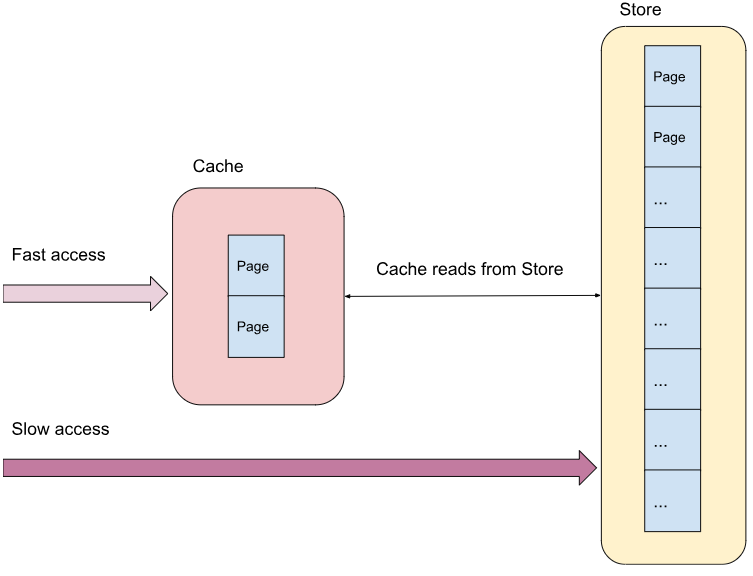
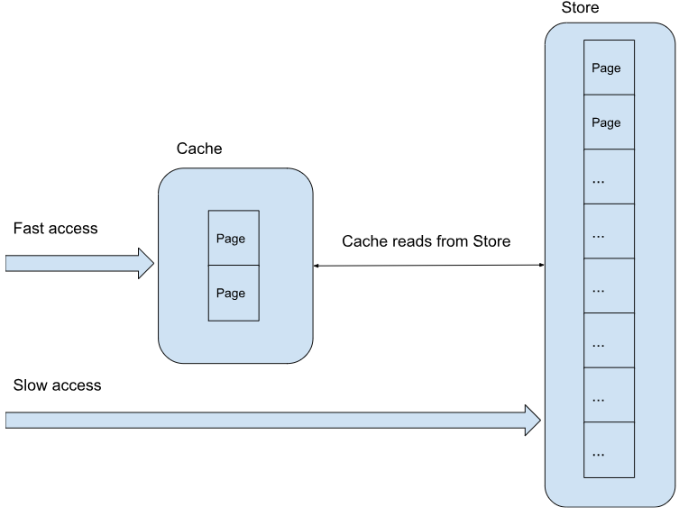

[](https://classroom.github.com/a/-ETRXeKq)
# Caching
<!--- The assignment is available [here](https://docs.google.com/document/d/1krVDlHdCIv8yh06-lXeByNJrssV6ib1xtKPMiS56pYk/edit?usp=sharing). --->



## Introduction

There is a truism in computer science:

```
    The fastest database is one that you don't use.
```
That's why we have caches. Caches allow us to exploit locality, with the reasoning that items that are close together are likely to be reused. So we store items in by fronting slow memory with a cache in fast memory, and that should help speed up our programs.  In the database case, we cache elements of the database in memory, to avoid slow database accesses.

Unfortunately cache memory is expensive (otherwise we'd build everything out of fast cache memory). Caches are therefore much smaller than the memory stores that they front. This means that we have to figure out what to cache. As the cache fills up, we have to figure out what to [evict from the cache](https://en.wikipedia.org/wiki/Cache_replacement_policies) in order to bring new items in.

In this assignment, we are going to explore the different cache replacement strategies by building a cache.


## Objects

There are 3 classes of things in our simulation: 
1. Pages of memory
2. A slow memory Store of Pages
3. The fast Cache that fronts the Store



There are no classes in C, so we will implement them as structs with associated functions instead.


### Page

A Page represents memory. In our simulation, a Page is a block of 4 bytes of memory.


```
    #define PAGESIZE 4

    typedef struct {
        int pageno;
        unsigned char bytes[PAGESIZE];
    } page_t;
```


There are several functions in page.h and page.c that allow you to manipulate a page. This is provided for you, and you don't have to do anything else.


### Store

A Store represents a slow main memory store. It's basically an array of Pages.


```
    // A store is an array of pages
    typedef struct {
        int numpages;
        page_t* pages;
    } store_t;
```


There are two functions you have to write:


```
    // Initialize a memory store with the given number of pages
    // This creates numpages of Pages in the store and initializes
    // the content of each Page to 0
    void store_init(store_t* store, int numpages);

    // Return the page corresponding to the given memory location
    page_t* store_get(store_t* store, int location);
```


The [memset](https://man7.org/linux/man-pages/man3/memset.3.html) library function might be useful to you when initializing memory.

Retrieving a value from the store is very slow:


```
    // The latency of a memory lookup from the store 
    // (much larger than the cache)
    #define STORE_LATENCY 10
```


We also have a <strong><code>store_free</code></strong> function to free the store of memory when we are done with it. Always free memory that you allocate after you are done with it. Memory leaks are evil.


### Cache

The cache object represents the fast memory. Retrieving a value from the cache is very fast:


```
    // The latency of memory lookup from the cache 
    // (much smaller than the store)
    #define CACHE_LATENCY 1
```


The cache is governed by its replacement policy. The best cache replacement policy is the [Clairvoyant policy](https://en.wikipedia.org/wiki/Cache_replacement_policies#B%C3%A9l%C3%A1dy's_algorithm). This one will replace the item that will not be needed for the longest time in the future. The Hungarian computer scientist László Bélády came up with this algorithm, so it is also known as the Bélády strategy.

Clairvoyance is pretty cool, but you have to predict the future for it to work. Unfortunately we can't predict the future, so we have approximations to this.

The possible cache replacement policies are represented in this C enum (read `The C Programming Language` to learn about enums):
```
    // Cache replacement policies
    typedef enum {
        FIFO,
        LRU,
        MRU,
    } policy_t;
```


The three policies you have to implement in this simulation are:


* **FIFO**, for First In First Out. This means that the item that was allowed first to the cache is the first item that will be evicted to make way for a new item.
* **LRU**, for Least Recently Used. This means that the item that was used furthest in the past is the item that will be evicted to make way for a new item. 
* **MRU**, for Most Recently Used. This means that the item that was most recently added is the one that will be evicted to make way for a new item.

Which replacement strategy is best in a particular situation is heavily dependent on memory access patterns that are observed. In most general cases, LRU is the best approximation of the Clairvoyant algorithm. However, even counter intuitive ones like MRU can work well, when the access pattern is something like repeated sequential looping.

Each entry in the cache is basically a pointer to the Page that is cached, together with some metadata you will need when you implement the replacement policy.


```
    // A cache entry is a pointer to a page, and some metadata 
    // associated with it
    typedef struct {
        page_t* page;

        // Add more fields to the entry as you need
        // ...
    } entry_t;
```


The cache itself is an array of cache entries.


```
    // A cache is simply an array of cache entries of the given size
    typedef struct cache {
        store_t* store;           // pointer to the store
        policy_t policy;          // the cache replacement policy
        int size;                 // the cache size
        entry_t* entries;         // the array of entries

        // Add more fields as needed
        // ...
    } cache_t;
```


You have 4 cache functions to implement:


```
    // Initialize a cache of the given size number of pages.
    // The cache is backed by the store and is governed with the given 
    // cache replacement policy.
    void cache_init(cache_t* cache, int size, store_t* store, policy_t policy);

    // Free memory allocated for the cache
    void cache_free(cache_t* cache);

    // Return the value in memory corresponding to the given memory location.
    // This function looks up whether the page exists in the cache first.
    // If it does, it retrieves the Page from the cache, and updates the cache,
    // and returns the value.
    // If the Page is not present, it goes to the store to retrieve the page,
    // updates the cache and returns the value.
    // The time required for the get is set in the latency pointer.
    unsigned char cache_get(cache_t* cache, int memory_location, int* latency);

    // Return true if the page with page_no is present in the cache
    bool cache_contains(cache_t* cache, int page_no);
```


Initially, the cache is empty. When the user retrieves values from memory locations, the cache retrieves the corresponding Page from the Store, and saves it in the cache. On gets when the Page is not in the cache, cache_get should set STORE_LATENCY in the third argument. 

Future access to the same Page will be fast because the Page is now in the cache. If the Page is in the cache, cache_get should set CACHE_LATENCY in the third argument.

As the user accesses more Pages, the cache will fill up. When the cache is filled up, a new Page will need to evict a Page already in the store. The replacement policy determines which item is evicted. Your cache should have implementations of each of the 3 possible cache replacement strategies. 


## Main

You should also write the main program. The main program allows you to set the simulation by accepting 3 optional parameters: 


* **-s storesize**. If not specified, the store size is 16 pages.
* **-c cachesize**. If not specified, the cache size is 4 pages.
* **-p policy**. If not specified, the policy is FIFO.
    * The policy argument string is in lowercase (e.g. "fifo", "mru", "lru")

If the user types in wrong args, main should respond with:
```
Usage: ./cache_sim [-s storesize] [-c cachesize] [-p policy]
```
Please **exit with a value of 0** even if the user enters wrong args.

Your simulation should initialize a store and cache with the given policy. Then it should continue reading ints from standard input until it reads an EOF. 

* Each int is a memory location.
* Call <strong><code>cache_get()</code></strong> with the location that was read. Keep track of the <strong>total latency</strong> so far.
* When EOF is reached, print the total latency that was observed. For example, if the total latency is 12, then you should print:

```
Total latency=12
```
Remember to free the store and the cache at the end of the simulation, otherwise you will get memory leaks.


## Testing

Build and run your app with 
```
make run
```

Automated tests for the cache are available at
```
make test
```
