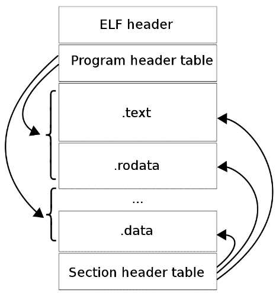
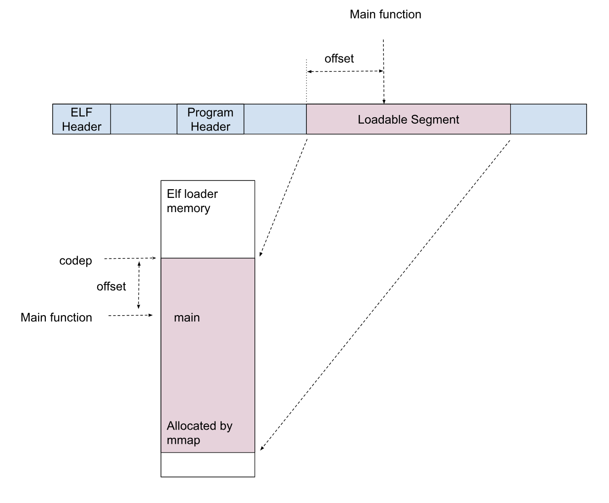

[](https://classroom.github.com/a/QgKPgJq8)
# Elf Loader
<!--- Access your assignment [here](https://docs.google.com/document/d/1m0JRglrkdW9rgp62qT87hpn0zv1fo5p7P0fv7KBAJYc/edit). --->


## Introduction

ELF stands for Executable and Linking Format, and is the standard format for most Unix systems.[^1] This defines a standard format for all executable and object files, as well as library and shared library files. When you execute a file, the OS reads the file, sanity checks that it is in ELF format, then reads the bits on disk into memory according to the layout in the ELF file, and jumps into the correct entry point in memory to start executing it.

Similarly, all our compilers like GCC produce ELF files. ELF is the same across Unixes, though the endianness and size of fields can matter if it is 32 bit or 64 bit. The actual machine code of course is different. ARM code and x86-64 code will be different in their respective environments, while the format of the ELF container is still the same across architectures.

In this assignment, we're going to write our own ELF loader. The loader reads ELF files, loads it into memory correctly, and then executes the code there to derive an answer. In the process, we'll learn all about ELF and dealing with machine code.


## Environment

You'll need a 64 bit Unix environment to do this homework.


* The first (and very good) choice is to SSH into and use the lab machines.
* Windows users can use WSL or spin up a VM
* MacOS users can spin up a 64-bit Linux VM if you have an Intel Mac (note: you cannot do this homework using MacOS natively. The binaries produced by MacOS are not ELF).
* MacOS users with ARM Macs must use the lab machines
* ChromeOS users can use Linux


## Reading

The best source of information about ELF is the textbook. This [article](https://wiki.osdev.org/ELF_Tutorial#ELF_Sections) is also a good summary. Before you start writing the code, you should look at the Unix man page for ELF. At the terminal command line, type:
```
	man elf
```

The structures we will use for ELF are imported into our code with `#include <elf.h>`, and described in the [man page](https://man7.org/linux/man-pages/man5/elf.5.html).

Understand ELF thoroughly, and it will help you to do this homework.


## Structure of an ELF File



Executable files are produced in the [ELF format](https://man7.org/linux/man-pages/man5/elf.5.html). This format tells the operating system how to load the file, and where the entry point is in virtual memory. 


### ELF Header

The ELF header indicates that this is an ELF file. The ELF header appears at the beginning of the ELF size. An x86-64 executable will have this struct embedded at the beginning of it.


```
          #define EI_NIDENT 16

           typedef struct {
               unsigned char e_ident[EI_NIDENT];
               uint16_t      e_type;
               uint16_t      e_machine;
               uint32_t      e_version;
               ElfN_Addr     e_entry;
               ElfN_Off      e_phoff;
               ElfN_Off      e_shoff;
               uint32_t      e_flags;
               uint16_t      e_ehsize;
               uint16_t      e_phentsize;
               uint16_t      e_phnum;
               uint16_t      e_shentsize;
               uint16_t      e_shnum;
               uint16_t      e_shstrndx;
               } Elf64_Ehdr;
```


The first 16 bytes hold the member<strong><code> e_ident</code></strong>, and this describes how to interpret this ELF file. The first four bytes hold 0x7F, then the characters 'E', 'L' and 'F'. If you don't see these magic bytes when you load a file, it's definitely not an ELF file!  The fifth byte identifies whether this is a 32 bit or 64 bit file. Other bytes in e_ident identify various other things.

The member <strong><code>e_type</code></strong>describes whether the file is a relocatable .o, or an executable file, or a shared library.  In our case, we will be working only with executable files.

The member <strong><code>e_entry</code></strong> describes the entry point in memory to which the system should transfer control when running the program. This is an important one for us. This is where the code for the main function exists when the file is loaded into memory.


### Program Header Table

For an executable file, the next entry <strong><code>e_phoff</code></strong> in the ELF header holds the offset from the beginning of the file where the program header table is stored. The program header table exists for executable or shared object files.  It is an array of structures, each describing a segment or other information the system needs to prepare the program for execution.  The ELF header holds <strong><code>e_phnum</code></strong>, indicating the number of entries.

For x86-64, each entry in the the program header table is described by this struct:


```
           typedef struct {
               uint32_t   p_type;
               uint32_t   p_flags;
               Elf64_Off  p_offset;
               Elf64_Addr p_vaddr;
               Elf64_Addr p_paddr;
               uint64_t   p_filesz;
               uint64_t   p_memsz;
               uint64_t   p_align;
           } Elf64_Phdr;
```


<strong><code>p_type</code></strong> indicates the type of the program header entry. For our purposes, we are interested in loadable segments of type <strong><code>PT_LOAD</code></strong> that are executable. These are segments of code or data that must be loaded into memory in order to execute the program.  If <strong><code>p_flags</code></strong> has the <strong><code>PF_X</code></strong> bit set, then the loadable segment contains executable code. <strong><code>p_vaddr</code></strong> tells the system at what virtual address the segment should be loaded at. <strong><code>p_memsz</code></strong> tells how large the segment is. 


### Section Headers

The section headers are used to track and link symbols. The assembler encounters symbols which it does not initially know the address of. It keeps track of these symbols in the symbol table, and then goes back in a second pass to fix up the locations. The section headers are used for this purpose. We won't worry about them too much in this homework.


## Examining an ELF file

Let's create a simple executable file and examine it. Write this as **simple.c**.


```
    int main(int argc, char** argv) {
        int x = 5;
        int y = 13;
        return x + y;
    }
```


Let's compile this with
```
	gcc -fno-pic -static -fno-builtin -fno-omit-frame-pointer simple.c
```
This should give us an a.out. The -f options simplify the output.

We can examine ELF files with the command **[readelf](https://man7.org/linux/man-pages/man1/readelf.1.html)**.
```
	readelf --file-header a.out
```

The -h option means to print out the ELF header. This will produce output that looks like this:


```
ELF Header:
  Magic:   7f 45 4c 46 02 01 01 03 00 00 00 00 00 00 00 00 
  Class:                             ELF64
  Data:                              2's complement, little endian
  Version:                           1 (current)
  OS/ABI:                            UNIX - GNU
  ABI Version:                       0
  Type:                              EXEC (Executable file)
  Machine:                           Advanced Micro Devices X86-64
  Version:                           0x1
  Entry point address:               0x400a50
  Start of program headers:          64 (bytes into file)
  Start of section headers:          842952 (bytes into file)
  Flags:                             0x0
  Size of this header:               64 (bytes)
  Size of program headers:           56 (bytes)
  Number of program headers:         6
  Size of section headers:           64 (bytes)
  Number of section headers:         33
  Section header string table index: 32
```


You can see that the entry point is 0x400a50, and that the program header starts at 64 bytes into the file, and there are 6 program headers.

We can examine the program header using 
```
	readelf --program-headers a.out
```

This will produce output that looks like this:
```
Elf file type is EXEC (Executable file)
Entry point 0x400a50
There are 6 program headers, starting at offset 64

Program Headers:
  Type           Offset             VirtAddr           PhysAddr
                 FileSiz            MemSiz              Flags  Align
  LOAD           0x0000000000000000 0x0000000000400000 0x0000000000400000
                 0x00000000000b559e 0x00000000000b559e  R E    0x200000
  LOAD           0x00000000000b6120 0x00000000006b6120 0x00000000006b6120
                 0x00000000000051b8 0x00000000000068e0  RW     0x200000
  NOTE           0x0000000000000190 0x0000000000400190 0x0000000000400190
                 0x0000000000000044 0x0000000000000044  R      0x4
  TLS            0x00000000000b6120 0x00000000006b6120 0x00000000006b6120
                 0x0000000000000020 0x0000000000000060  R      0x8
  GNU_STACK      0x0000000000000000 0x0000000000000000 0x0000000000000000
                 0x0000000000000000 0x0000000000000000  RW     0x10
  GNU_RELRO      0x00000000000b6120 0x00000000006b6120 0x00000000006b6120
                 0x0000000000002ee0 0x0000000000002ee0  R      0x1
```


We can see that there are two loadable segments. The first starts at 0x400000, and the second starts at 0x6b6120. The first one is a code segment, and the second one is the data segment. To simplify this assignment, we are only going to consider the code segment.

Notice that the code segment starts at a virtual address of 0x400000. The entry point in the ELF header says that the main function is at 0x400a50, so you can see that the code should be loaded into virtual memory starting at 0x400000, and then the main function itself starts at virtual memory address 0x400a50. The offset of the entry point is at 0xa50 from the start.

The other headers represent the C standard libraries that are linked into the program. We don't have to worry about their details for this assignment. We will just focus on the loadable sections.


### Loader

Given all this information, we can write a loader for our programs. What the loader does is to:


1. Read a file
2. Confirm that the file is an ELF file by checking that the file has a magic 0x7F and ELF as the first four bytes
3. Read the program header table and check that it is not malformed
4. Load the loadable segments into memory at the right locations
5. Then jump into the entry point to start executing the program


## Creating an Executable File

Consider this C program `test1.c` (this file is an actual test file in the test/ directory in this homework assignment).
```
    unsigned int main(int a, int b) {
        return a + b; 
    }
```


We are used to thinking of `main` as having an `int` `argc` and a `char** argv`, but that is actually just a convention that is used by Unix. In our case, the main programs that we will use in this homework 
* take two ints as parameters, and 
* return an unsigned int as a value.

We can compile the file to an executable using:
```
gcc -c -fno-pic -static -fno-builtin -fno-omit-frame-pointer test1.c
ld -N -e main -Ttext 0 -o test1 test1.o
```


Again, the `-f `options are used to simplify the output that is produced. We will only have code that does not have relocations and can simply be loaded into memory anywhere and then run.  The -c option creates a .o file, and then we use `ld` to link the file. The -e directive tells the loader that the entry point is the function called main, and -Ttext 0 says to make the code start at virtual address 0.  The -N directive says to make the text and data sections both readable and writable. Having the code load at virtual address 0 simplifies your loading task later.

You can examine the ELF file for all the test cases, test1 through test4, with readelf. 


## Your Task

Your task is to write the <strong><code>elfloader</code> </strong>program in elfloader.c. This program loads special ELF files that use our convention for main. Our main programs take two ints as arguments, and then returns an unsigned int as a result.

The <strong><code>elfloader</code></strong> program takes a command line like this:
```
	./elfloader file arg1 arg2
```
The file is the special ELF file that conforms to our convention for main. Arg1 and arg2 are integer arguments that will be passed to the program as arguments. The <strong><code>elfloader</code></strong> will load the ELF file, call into main with the two arguments, and print the result.

The overall approach for <strong><code>elfloader</code></strong> is:
1. Check that the command line arguments are valid. If not valid, print the usage and quit.
2. Read the given file. Make sure you **open the file for reading in [binary mode](https://www.equestionanswers.com/c/c-binary-mode.php)**. Executable files are not text files. If you don't open it in binary mode, then odd things can happen as binary is interpreted as text.
3. Confirm that the file is an ELF file by checking that the file has a magic 0x7F and ELF as the first four bytes. 
4. Read the program header table. You can move around in a file by using **[fseek()](https://man7.org/linux/man-pages/man3/fseek.3.html)** to get to the correct location in the file where the program header exists.
5. The program header will tell you where the loadable segments are in the ELF file, and how large they are. The test files only have one segment.
6. Allocate memory in your program that can hold the executable code from the ELF file.
7. Load the executable loadable section into memory. Do this by reading the ELF file at the right location, and copying those bytes into the previously allocated memory.
8. Now that the program is loaded into memory, we have to run it.  
    * Jump into the entry point specified in the ELF header to start executing the program.  
    * The entry point will be at the given offset that was specified in the headers from the start of the allocated memory segment.
9. Print the answer that comes back as <strong><code>printf("Answer=%d\n" answer);</code></strong>


### Creating Memory to Load Segments Into

The program header table will indicate that it has an executable loadable segment. This contains code for the program you are given to load. You have to allocate memory to load the code into.  

Unfortunately you can't use `calloc` or `malloc`, because that will allocate memory that is read and write, but not executable. In order to create memory that can contain executable code, we have to use the <strong><code>[mmap()](https://man7.org/linux/man-pages/man2/mmap.2.html)</code></strong> call.  To allocate <code>memsz</code> bytes of memory is that read, write and executable, we use this call below:
```
	void* codep = mmap(NULL, memsz, PROT_READ | PROT_WRITE | PROT_EXEC,
    		MAP_ANONYMOUS | MAP_PRIVATE, 0, 0)
```


This will give back an area of memory in <strong><code>codep</code></strong> that you can load executable code into. The `mmap()` call tells the operating system to allocate pages for you that are marked correctly for execution, and adjust the page tables appropriately so that these pages are now valid in your program's virtual address space.

Once you are done with the space allocated by `mmap()`, it is good practice to call `munmap()` to deallocate space for it.


### Jumping into the Entry Point

Once you load the code into memory, you can then define a pointer to a function and jump to it. Since our main program has this signature:
```
    unsigned int main(int a, int b);
```


That means that we can define a pointer to a function that takes two ints as arguments and returns an unsigned int. We just have to find the offset in the loadable segment where the main function exists. Then we can call the main function, and get back the result.
```
    // mainfunc is a pointer to a function that takes two ints 
    // and returns an unsigned int 
    unsigned int (*mainfunc)(int, int) = codep + offset;

    // Call the main func in the ELF program
    int result = (*mainfunc)(arg1, arg2);
```

The diagram below shows how things are connected between the ELF file and the mmap'd region in memory.


### Error Handling

Your elf loader program must handle errors like this:


* Elfloader expects 3 arguments, the executable file, and two numbers. If that is not given, print an error to stderr, and return with an exit code of 1.
* If the executable file cannot be opened or the ELF header cannot be read, or the ELF header is malformed, print an error to stderr and return with an exit code of 2.
* If the program header table cannot be read or is not PT_LOAD, or the program header flags does not have PF_X set,  print an error to stderr and return with an exit code of 3.


## Building and Testing

You can build your elfloader program with
```
	make
```

There are test files in the test directory. You can build each of these by typing "`make test1`", "`make test2`", "`make test3`", or "`make test4`". "`test5`" is already pre-built for you.  You can run your elf load program against these executables by typing "`./elfloader test1 5 6`" for example. This should print "`Answer=11`" if your program works correctly.


1. test1.c simply adds two numbers. The executable that is built is called test1, and the code segment is set to load at a virtual address of 0. The entry point is also 0.
2. test2.c simply adds the two arguments plus a constant. The executable that is built is called test2, and the code segment is set to load at a virtual address of 0. The entry point is non-zero, so the offset is the entry point minus 0, which is just the value of the entry point.
3. test3.c does subtraction. The executable that is built is called test3, and the code segment is set to load at a **virtual address that is greater than 0**. The offset is the **difference between the virtual address of the entry point and the virtual address where the segment expects to be loaded at.**
4. test4 is built from test3.c, but the executable is malformed in a way that our program can't accept and should throw an error.
5. test5 is a pre-built executable. It is malformed in some way.

Automated tests are run against your code when you type:
```
	make test
```

Individual tests are available with
```
	make test-test1
	make test-test2
	make test-test3
	make test-test4
	make test-test5
```


## Hints

You will need to read structures into memory and move around in a file. The C stdio functions will allow you to do that. 
* To open a file for reading, use `fopen()`
* To read a file, use `fread()`
* To move around to a location in a file, use `fseek()`

Consult the relevant man pages for more info.


## History

This homework is patterned after one that I did in undergrad almost thirty years ago, which I faintly remembered and spent a bunch of time reviving. This goes to show how much longevity the ELF format has had.


<!-- Footnotes themselves at the bottom. -->
## Notes

[^1]:
     Windows uses the [PE (Portable Executable) format](https://en.wikipedia.org/wiki/Portable_Executable), while MacOS uses [Mach-O](https://en.wikipedia.org/wiki/Mach-O).

