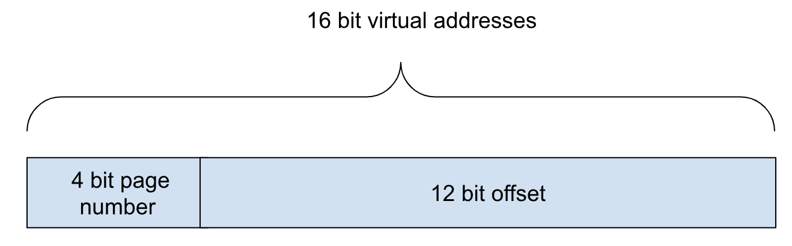
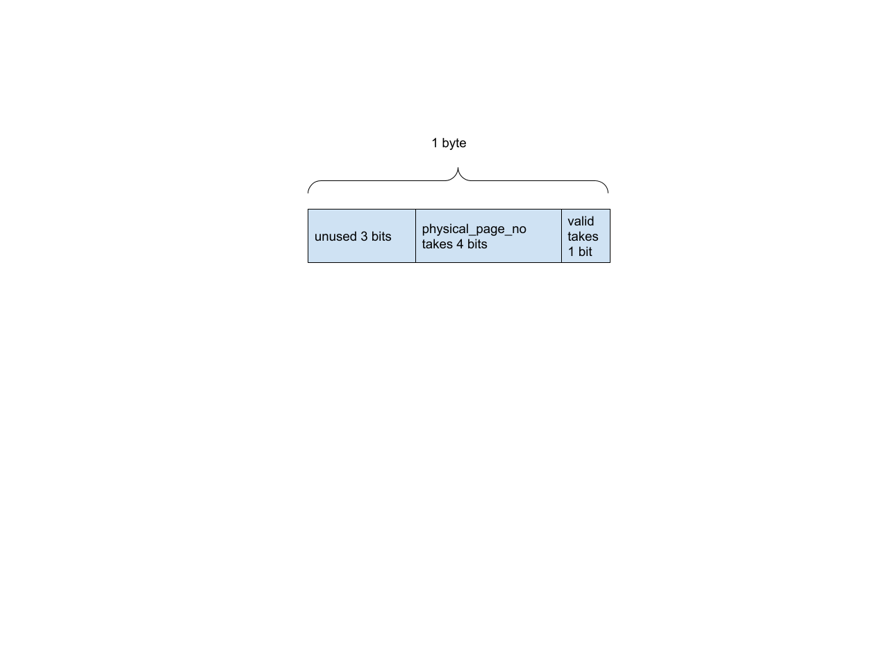
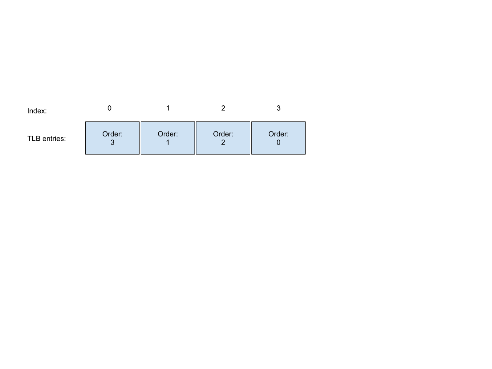

# Translation Lookaside Buffer (TLB)
<!--- Access the writeup [here](https://docs.google.com/document/d/1Z6LsYCS9VkVCkvD4f3WuA8nO8bG0oKX8Pr_jN-ZJmr4/edit#). --->


## Introduction

A Translation Lookaside Buffer (TLB) is a cache that is on the CPU chip. It serves to very quickly translate virtual addresses to physical addresses. The TLB stores recent translations of virtual addresses in a very fast module to help CPU instructions that use virtual addresses. Without the TLB, the CPU would have to look up page tables that are very large and stored in main memory. Main memory access is too slow, hence the TLB.


## Our Virtual Memory System

The virtual memory system we work with has only 16 bits.  Page sizes are 4096 bytes, which means that the offset in a page is 12 bits, since 2<sup>12</sup> = 4096. The 4 upper bits are the page number.



There are 2<sup>4</sup> = 16 pages. With only 16 pages of 4096 bytes for each page, this computer only holds 16 ✕ 4096 = 64K of memory.


## Page Table

A page table maps virtual page numbers to physical page numbers. The operating system is in charge of maintaining per process page tables for each program that runs on the system.


```
    // A page table entry (PTE) has the
    // corresponding physical page number. If the valid bit is not set,
    // then the PTE is invalid
    typedef struct {
        unsigned char valid: 1;
        unsigned char physical_page_no: 4;
    } PageTableEntry;

    // The page table has 16 entries
    #define PAGE_TABLE_SIZE 16

    // A page table is an array of page table entries
    typedef struct {
        PageTableEntry entries[PAGE_TABLE_SIZE];
    } PageTable;
```


Page tables can be very large in systems with large virtual address sizes (e.g. 64 bit systems), so it is a good idea to make page table entries as space efficient as possible. We use [C bit field notation](https://www.tutorialspoint.com/cprogramming/c_bit_fields.htm) to save on storage. Each PTE takes only one char, with the valid field taking one bit, and the physical page number taking the next 4 bits, for a total of 5 bits. Since we can't have less than a byte, each PTE is one byte.




Since the simple system we are working with has 4 bit page numbers, that means that we have a maximum of 2<sup>4 </sup>= 16 virtual pages. A page table is represented as an array of 16 PTEs. Since each PTE is one byte, the whole page table is only 16 bytes.

This computer only has a valid bit. Since there are no present or protection bits, this computer does not implement swapping to disk or finer grained controls on how the memory can be accessed.


### Virtual Address to PTE

When given a virtual address, the corresponding PTE is calculated first by finding the upper 4 bits of the virtual address to get the virtual page number. For example, given a virtual address of `0x53a8`, we see that the lower 12 bits are `0x3a8`, and the upper 4 bits are `0x5`. The virtual page number is therefore `0x5`.


When you have a page table object `PageTable* ptab`, the entry for the translation of virtual page number 5 is given by `ptab->entries[5]`. In general, convert the virtual address to the virtual page no, then index in the right place in the page table entry array.
```
	unsigned short virtual_page_no = to_page(virtual address);

	PageTableEntry* pte = &ptab->entries[virtual_page_no];
```


To determine if the page table entry is valid, check the `valid` bit. For the physical page number that corresponds to the virtual page number, check the `physical_page_no` field.


## TLB

The TLB is a cache of recent page table entries. It usually lives on the CPU chip or between the CPU and memory.


```
    // A TLB entry consists of the following fields.
    // 1 bit that indicates whether the TLB entry is valid
    // 2 bits indicating the last used order
    // 4 bits for the virtual page number
    // 4 bits for the physical page number
    typedef struct {
        unsigned int valid: 1;
        unsigned short order: 2;
        unsigned short virtual_page_no: 4;
        unsigned short physical_page_no: 4;
    } TLB_Entry;

    // The number of TLB entries in the TLB
    #define TLB_SIZE     4

    // A TLB is an array of entries of TLB_SIZE
    typedef struct {
        TLB_Entry entries[TLB_SIZE];   // an array of entries
    } TLB;
```


The TLB itself is an array of 4 TLB entries. Each entry has 4 members:

* `valid` indicates whether the TLB entry is valid and contains a translation from virtual page to physical page
* `virtual_page_no` indicates the virtual page number
* `physical_page_no` indicates the physical page number that corresponds to the virtual page number
* `order` indicates the relative order in which the TLB entry was accessed. The valid values are 0, 1, 2 and 3. 
    * 0 indicates it was most recently used for a successful translation
    * 3 indicates it was used furthest in the past.


## How the TLB works

These are the steps the CPU takes when it has a virtual address to translate:


1. The CPU presents the virtual address to the TLB.
2. The TLB calculates the virtual page number from the virtual address.
3. It looks up in the array of TLB entries whether there is any match. (In hardware implementations, this is done in a set associative query where all entries are matched at once. In our implementation, we will have to do it entry by entry.)
4. If a matching entry is found:
    1. the TLB calculates the physical address by replacing the virtual page number with the physical page number. 
    2. It updates the order of access, and returns the physical address to the CPU, and the TLB is done.
5. If the entry is not found, then this is a cache miss. 
    3. The TLB has to load the entry from the page table.
    4. Using the virtual page number, the TLB looks up the page table entry in the page table. If the page table entry is valid, then the TLB loads the entry into itself.
        1. TLB loading is done by finding the least recently used entry, and loading the page table entry into the least recently used entry.
        2. Update the order of access and return the physical address to the CPU
    5. If the entry in the page table is invalid, then this is a memory access error, or segmentation violation. The program should not have tried to access this memory.


## Managing Order of Access

Each TLB entry has an order of access field:

```
    typedef struct {
        unsigned int valid: 1;
        unsigned short order: 2;
        unsigned short virtual_page_no: 4;
        unsigned short physical_page_no: 4;
    } TLB_Entry;
```


The field can hold 0, 1, 2 or 3, and is used to indicate the order of access of the entry. 0 is most recent, with 3 being the furthest in the past.  When it comes time to evict an entry, the entry with the largest order value is used.

Suppose the TLB entries have this order of use initially:


Now assume that index 1 is accessed. The order changes to:


Next assume that index 3 is accessed. The order changes to:



Next assume that index 0 is accessed. The order changes to:


### TLB Initialization

When the system starts up, the TLB entries are initialized such that the TLB order values are unique. There is always an entry with the order 0, an entry with the order 1, an entry with the order 2, and an entry with the order 3. 


### Order of Access Algorithm

The algorithm is:

1. If the index that is last accessed has an order of 0, then nothing changes.
2. Otherwise, the index that is last accessed has its order set to 0
3. The order of every other element is increased by 1, but never more than 3.
    1. Be careful: order is only 2 bits. Adding 1 to an order value of 3 will result in it being set to 0.

<!--- 
## Your Task


Your task is to implement a simulation of a TLB. You are given these functions:

* <strong><code>void tlb_dump(TLB* tlb)</code></strong> -- This prints out the contents of a TLB, and is very useful for debugging.
* <strong><code>bool tlb_lookup_and_load(TLB* tlb, PageTable* ptab, unsigned short virtual_address, unsigned short* physical_address)</code></strong> -- Lookup a virtual address. 
    * Given a virtual address, lookup the virtual address in the TLB to get the physical address. 
    * If the TLB doesn't hold the physical address, load it from the page table. If the page table entry is invalid, return false. 
    * If the page table is valid, set *physical_address to the physical address, and return true. 
    * This function uses the other functions you will write below. Study it carefully.

The first functions you have to write deal with virtual addresses:

* <strong><code>unsigned short to_page(unsigned short virtual_address)</code></strong> -- Given a virtual address, return the virtual page no. The virtual page number is the upper 4 bits of the 16 bit virtual address.
* <strong><code>unsigned short to_offset(unsigned short virtual_address)</code></strong> -- Given a virtual address, return the offset within the physical page.  This is the lower 12 bits of the address.
* <strong><code>unsigned short to_address(unsigned short page_no, unsigned short offset) </code></strong>-- Return an address by combining a page number and an offset

The next function deals with maintaining the ordering of the TLB entries.

* <strong><code>void tlb_set_order(TLB* tlb, int last_used_index)</code></strong> -- Update the order for the TLB Entry at last_used_index to 0, and update the order for all the other TLB entries appropriately. This basically implements the algorithm in the "Managing Order of Access" section above.

The next function looks up a virtual address in the TLB.

* <strong><code>bool tlb_lookup(TLB* tlb, unsigned short virtual_address, unsigned short* physical_address)</code></strong> -- Lookup a virtual address. Given a virtual address, lookup the virtual address in the TLB. 
    * If the virtual address is present in the TLB, set *physical_address and return true.  
    * If the TLB does not contain the virtual address, return false. 
    * The lookup order in the TLB is updated.

The next function loads a page table entry into the TLB.

* <strong><code>TLB_Entry* tlb_load(TLB* tlb, unsigned short virtual_page_no, PageTable* ptab)</code></strong> --  Evict an entry from the TLB and read in the corresponding page table entry for the given virtual address from the page table. 
    * The replacement policy is to evict the least recently used entry. 
    * The lookup order in the TLB is updated. 
    * Return a pointer to the TLB entry that was updated. 
    * Note: the PTE may not be valid, but this function doesn't worry about it. It just returns the TLB entry that was updated.


## Building and Testing

Build your program with 
```
	make
```

There is a small main program in main.c. Build and run it with 
```
	make run
```


Tests are available with
```
	make test
```
--->
