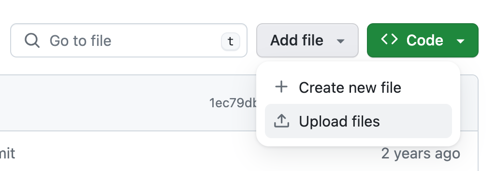
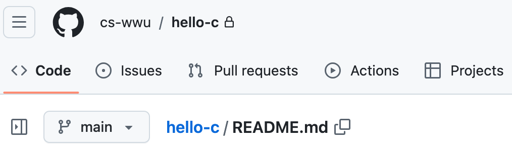
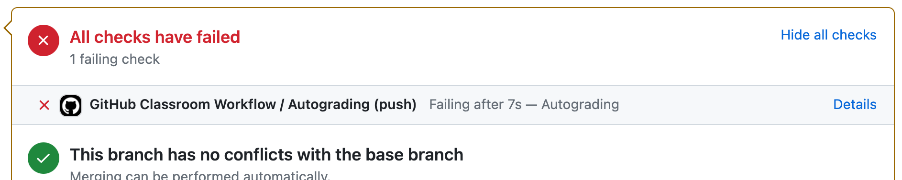

# Hello World

## Your Task
Write a C program in the file **hello.c**. The program should print "**Hello World**" followed by a newline. That's all.

Write it, compile it and test that it actually works before submitting it.

## Submitting
Submit your program to this repo. The easiest way is to click on the `Add File` button and then `Upload files`.
Just upload your source code file **hello.c**.

## Check for Success
Check that the autograder successfully graded your homework. Do this by clicking on `Actions` at the top menu bar. 

If the Feedback shows that your submission failed, as in the figure below, click on `Details` to find out why and debug your failure.

Fix your code and resubmit till you pass.

## Hints
`main` should return an int. If you don't, then whatever is in register `%eax` is the exit code of your program.
If your program returns anything other than 0, your program is assumed to have failed.

## Cautions
You must submit **hello.c**. If you submit **HelloWorld.c** or any variation thereof, you will fail.
You must print exactly "**Hello World**" followed by a newline. If you print anything else, you will fail.
You must check that the autograder gives you the correct grade. If you didn't check, you might not pass.
