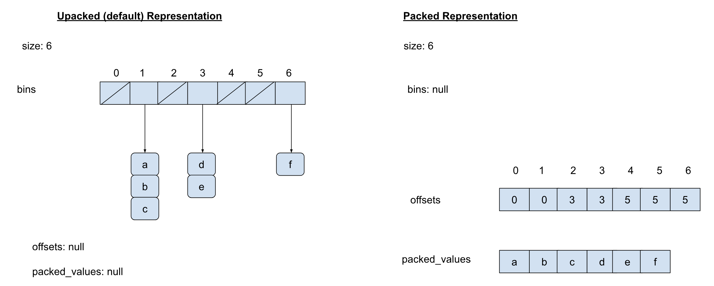
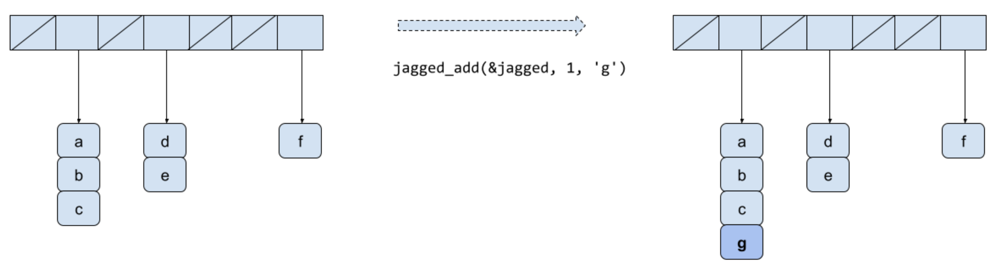
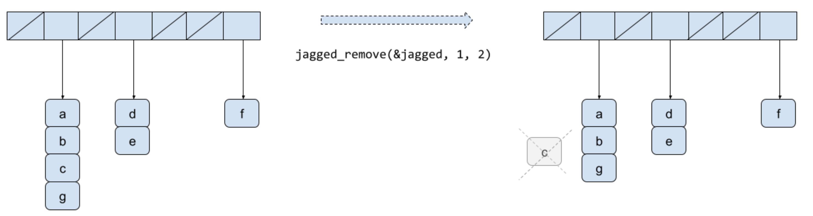

[](https://classroom.github.com/a/jLKvTQSS)
# Jagged Array in C


# Introduction

A jagged array is an [array](https://en.wikipedia.org/wiki/Array_data_structure) of arrays of which the member arrays can be of different lengths, producing rows of jagged edges when visualized as output. In contrast, two-dimensional arrays are always rectangular, so jagged arrays should not be confused with [multidimensional arrays](https://en.wikipedia.org/wiki/Array_data_type).

A jagged array is useful when you have data in two dimensions that may not be fully matrixed. When 2D arrays become very large, entries with lots of 0s become very wasteful in terms of space.


# Representations

There are two possible representations of jagged arrays. The default representation is the **unpacked** one. In this representation (shown on the left in the figure below), the array actually looks jagged. The unpacked values representation holds a bin of objects stored at that array index. This example has seven bins holding six elements.
 
- bin 0 is empty
- bin 1, slot 0 holds 'a'
- bin 1, slot 1 holds 'b'
- bin 1, slot 2 holds 'c'
- bin 2 is empty
- bin 3, slot 0 holds 'd'
- bin 3, slot 1 holds 'e'
- bin 4 is empty
- bin 5 is empty
- bin 6, slot 0 holds 'f'
  
In the **packed** representation (as shown on the right in the figure above), the unpacked_values array is null. Instead, the offsets array holds an array of offsets. These offsets index into a single large packed_values array that holds all the values. The values are grouped by bin, but tightly packed. Each bin's offset value is the index into the packed_values array of the first element in the bin. If the next bin's offset value is the same, then the current bin has no elements. If the current bin is the last bin, there is no next bin, but you can tell if the current bin has any items by looking at the size of the jagged array.

We can convert an unpacked jagged array into a packed jagged array by calling the <strong><code>pack()</code></strong> method. This has no effect if the jagged array is already packed. Similarly, we can go from a packed representation to an unpacked one by calling <strong><code>unpack()</code></strong>. This also has no effect if the jagged array is already unpacked.  You can pack and unpack multiple times.

The jagged array stores elements of type int. 


# Modifying the Jagged Array

Jagged arrays can **only be modified when they are unpacked**. That's because the packed representation is great at space saving, but not so great with being flexible.

Elements are added to the jagged array with <strong><code>jagged_add(jagged_t* jagged, int bin, int element). </code></strong>This adds the element to the end of the given bin.  
The example below shows the effect of adding 'g' at bin 1. Note that the actual homework uses ints as the element type, but the example below uses chars for more clarity.


Elements are removed with <strong><code>jagged_remove(jagged_t* jagged, int bin, int slot)</code></strong>. This removes the element at the given bin and slot. The example below shows the effect of removing the element at slot 1, index 2. 



# Your Task
Your task is to implement the `Jagged Array` abstract data type in **jagged.c and jagged.h**. A skeleton is already given to you. Your implementation must use the structures given:


```
    // A bin is a linked list
    typedef struct entry {
        int value;
        struct entry* next;
    } entry_t;

    // A jagged array is made up to size number of array of pointers 
    // to bins in the unpacked representation, and the packed
    // representation is an array of values and an array of offsets.
    typedef struct {
        int size;
        int number_of_bins;

        // Unpacked representation
        entry_t** bins;

        // Packed representation
        int* packed_values;
        int* offsets;
    } jagged_t;
```


Your representation uses a linked list for the unpacked representation that you have to implement. You have to implement these methods:


```
    // Initialize a jagged array object with the given number of bins.
    // The array is initially unpacked.
    void jagged_init(jagged_t* jagged, int bins);

    // Free all memory associated with the jagged array
    void jagged_free(jagged_t* jagged);

    // Return the number of elements in the jagged array
    int jagged_size(jagged_t* jagged);

    // Return the number of bins
    int jagged_bins(jagged_t* jagged);

    // Return the number of slots in the given bin
    int jagged_slots(jagged_t* jagged, int bin);

    // Return the element stored at the given bin and slot number.
    // The value pointed to by success is set to 0 if the element 
    // was found, or -1 otherwise.
    // If the value pointed to by success is set to -1, 0 is returned.
    int jagged_element(jagged_t* jagged, int bin, int slot, int* success);

    // Add an element to the bin. Return 0 is the element was
    // added, or -1 if the representation is packed
    int jagged_add(jagged_t* jagged, int bin, int element);

    // Remove the element from the given bin and slot. Return 0 on success,
    // or -1 if the representation was packed or element not found.
    // Remember to free any memory that was previously allocated to store
    // the element.
    int jagged_remove(jagged_t* jagged, int bin, int slot);

    // Unpack the jagged array. Return 0 if successful or -1 
    // if the array is already unpacked.
    int jagged_unpack(jagged_t* jagged);

    // Pack the jagged array. Return 0 if successful or -1 if the array is already
    // packed.
    int jagged_pack(jagged_t* jagged);

    // Print a jagged array out. Useful for debugging.
    // Use any format you find useful. If you only use the methods
    // defined in the header to print, it should work for both packed
    // and unpacked representations
    void jagged_print(jagged_t* jagged);
```


# Memory Management

[Memory management is a big part of programming in C](https://www.tutorialcup.com/cprogramming/memory-management.htm) (and in C++). Languages like Java and Python are [garbage collected](https://www.dynatrace.com/resources/ebooks/javabook/how-garbage-collection-works/), so you create new objects and never have to delete them. Memory that is obsolete is automatically reclaimed for you. **In C (and C++), memory management is completely do-it-yourself**.

You allocate memory for an object with `malloc()` or `calloc()`. When you are done with the memory, you have to deallocate it with a call to `free()`. If you don't free memory when it stops being useful, then your program will have a [memory leak](https://en.wikipedia.org/wiki/Memory_leak). Memory leaks are bad, because your program will keep using more and more memory, eventually slowing your system down until it has to be rebooted. In fact, there are dozens of memory leaks in most commercial OS's like Windows. Most of these are small, but over time they accumulate and cause your machine to start running out of memory. That is one of the main reasons why you have to reboot your machine after a while.

In this homework, you must practice good memory management techniques. Every time you allocate memory with `malloc` or `calloc`, there must be a corresponding call to free when the memory is no longer needed. For example, when you allocate memory for something in `jagged_add()`, that memory must be freed when the element is removed in `jagged_remove(`). Similarly, all the memory that was allocated for the jagged array must be freed when `jagged_free()` is called.

The other side of being careful is that you should not free memory that was never allocated. That will result in the memory allocator getting messed up, and your program can also crash. Another common bug is freeing memory more than once. Again the memory allocator gets messed up, and your program will crash, or worse, behave in difficult to debug and unexpected ways.


## Valgrind

The last test in the automated test harness checks for memory leaks. It will report if your program fails to free memory that was previously allocated or if you did things like double freeing. The test harness uses the program called [valgrind](https://valgrind.org/), the standard tool for checking for memory leaks in C and C++ programs on Unix. Check for memory leaks with:
```
	make test-leak-valgrind
```
In the future, you can run valgrind on your own program like this:
```
	valgrind --leak-check=full <your program name and arguments>
```
Valgrind has many options. `valgrind --help` will show you all the options. Use valgrind to locate where your memory leaks are occurring, and fix them. 

Mac users can develop on MacOS till this part. From here on, you have to use a Linux VM or the lab machines in order to use valgrind. 


# Testing and Debugging

To build your code, type:
```
	make
```
This builds the executable "`jagged`", which you can run with "`./jagged`". You can debug it with "`gdb jagged`".

The automated test code is in the test directory in `test/test_main.cpp`. To test your code, type:
```
	make test
```
This builds the executable "`jagged_test`".. You can debug the test code with "`gdb jagged_test`". 

To run valgrind on the jagged program, do
```
	valgrind --leak-check=full ./jagged
```
To run valgrind on the test program, do
```
	valgrind --leak-check=full ./jagged_test
```
Gdb is your friend for seg faults. 


## MacOS

Mac users can use `lldb `as a debugger instead of gdb. Both gdb and lldb operate very similarly, with some simple syntax differences that you can read about online. For example, the table below shows the correspondence between gdb and lldb commands:


<table>
  <tr>
   <td>Operation
   </td>
   <td>gdb
   </td>
   <td>lldb
   </td>
  </tr>
  <tr>
   <td>Set breakpoint at main.c at line 152
   </td>
   <td><code>break main.c:152</code>
   </td>
   <td><code>breakpoint set --file=main.c --line=152</code>
   </td>
  </tr>
  <tr>
   <td>Run the program
   </td>
   <td><code>run</code>
   </td>
   <td><code>run</code>
   </td>
  </tr>
  <tr>
   <td>Step into a function
   </td>
   <td><code>step</code>
   </td>
   <td><code>step</code>
   </td>
  </tr>
  <tr>
   <td>Next line
   </td>
   <td><code>next</code>
   </td>
   <td><code>next</code>
   </td>
  </tr>
  <tr>
   <td>Print variable foo
   </td>
   <td><code>print foo</code>
   </td>
   <td><code>print foo</code>
   </td>
  </tr>
</table>


There is also a MacOS tool called **leaks** that you can use to detect memory leaks. The behavior of leaks may be different than valgrind, but it is a useful thing to run against on Mac. Try it with `leaks -atExit -- <your program name and arguments>. `To run `leaks` on the test program, do
```
	leaks -atExit -- ./jagged_test
```
If your program passes `leaks`, there is a good chance that it will pass valgrind. As a final step, **Mac users should always ssh into the lab machines and try it on valgrind to verify that it works on Linux**.
