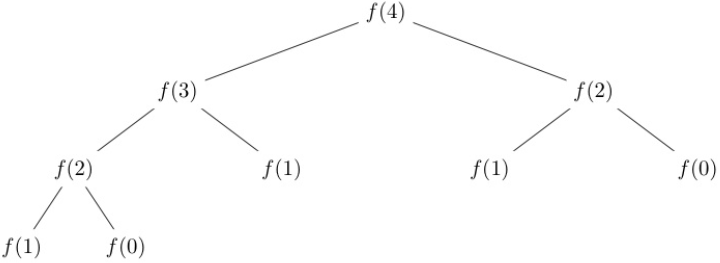

[](https://classroom.github.com/a/EHk41SH3)
# Profiling and Optization in C

<!--- Your assignment is available [here](https://docs.google.com/document/d/1kOhoFgHsBoYxjZ5PH2p6fkeyyXgUjJiY5kCgg-nI248/edit?usp=sharing). --->


## Introduction

This assignment has 4 parts, and each of the 4 parts is focused on optimizing a program that is given to you. You'll apply the optimization techniques you have learned in order to speed up a program anywhere from 1.5X to 100X. While it's not very often that you have to hand code assembler in order to speed up a program, it is still very common to **optimize your C code** to make it run faster. 

Sometimes, it is just not very obvious where your program is slow. Rather than guess what is slow and what is fast, you should first figure out what is slow. It's usually where the program spends most of its time. Programmers use tools called **profilers** in order to get a trace of where the program is spending most of its time, and then optimize that in a targeted way. Targeting your optimizations toward critical pieces of slow code is an excellent way of getting a lot of bang for your buck.

This exercise uses a Linux specific object file, so **you need to do it on a Linux machine**. WSL on Windows should work fine but
**it must be WSL v2** (you can tell with the command `"wsl --list --verbose"` on the Windows command prompt – profiling doesn't work on WSL v1), or the lab machines, or a VM running Linux on MacOS, or Linux on a Chromebook. Except for Task 1 below, you cannot do this assignment on MacOS. If you can't get the profiler to work on WSL (this shows up as profiling counts of 0 for everything) even if it's v2, move to the lab machines.


## Your Tasks


### Task 1. Algorithmic Optimization


#### Fibonacci

You should be familiar with the [Fibonacci](https://en.wikipedia.org/wiki/Fibonacci_number) sequence. This is one of the favorite algorithms taught when students learn recursion. Fibonacci is defined as

```
fib(0) = 0
fib(1) = 1
fib(n) = fib(n - 1) + fib(n - 2) for n > 1
```

Writing Fibonacci the standard recursive way gives you this call tree. You can see that values that were computed previously like fib(2) in the left hand tree are recomputed again in the right hand trees.





#### Oddinacci

The Oddinacci sequence is similar to the Fibonacci sequence, except that it behaves a little differently when the number is odd


```
    oddinacci(0) = 0
    oddinacci(1) = 1
    oddinacci(n) = oddinacci(n - 1) + oddinacci(n - 2) when n is even
    oddinacci(n) = <em>oddinacci(n - 1) + oddinacci(n - 2) + oddinacci(n - 3) when n is odd
```

It's simple enough to write a recursive version of oddinacci.  This is the function you are given.
```
    long oddinacci(long n) {
        if (n == 0 || n == 1) {
            return n;
        } else if (n % 2 == 0) {
            return oddinacci(n - 1) + oddinacci(n - 2);
        } else {
            return oddinacci(n - 1) + oddinacci(n - 2) + oddinacci(n - 3);
        }
    }
```

It takes a while to run for large `n`, as you expect.


#### Memoization

The recursive approach is super slow. Your first task is to implement <strong><code>oddinacci_fast</code></strong>, which produces the same answer as <code>oddinacci</code>, but is many many times faster. It should be at least 100 times faster. On my machine at home, it is 20,000 times faster for <code>oddinacci(45)</code>.

The recursive algorithm for Oddinacci starts at `n` and breaks the problem down into Oddinacci for `n - 1`, `n - 2`, and if n is odd, `n - 3`. Just like Fibonacci, it recomputes values that were already computed in previous recursive calls.

Rather than go top down, we can go bottoms up, and _remember_ the values that are already computed.  When you want to compute oddinacci of a number n, you should


1. Initialize an array of size `n + 1`
2. Set `array[0]` to be `0`. This represents `oddinacci(0)`.
3. Set `array[1]` to be `1`. This represents `oddinacci(1)`.
4. Then iterate with an index `i` from `2` upwards to `n`. 
    1. Compute `oddinacci(i)` from the numbers already computed that are smaller than `i`.
5. If you malloc'd any memory, free the memory you previously allocated when you are done. If you don't free the memory, then your `oddinacci_fast` function will have a memory leak each time it is called.

This is a very powerful technique called [memoization](https://en.wikipedia.org/wiki/Memoization#:~:text=In%20computing%2C%20memoization%20or%20memoisation,the%20same%20inputs%20occur%20again.), or dynamic programming. You are trading off storage for computation. If you did this correctly, you should get an impressive speedup. 

The lesson here is that algorithmic speedups are usually much more effective than other optimizations.


#### Testing

The functions are in **oddinacci.c** and **oddinacci_main.c.** You can run the program with 
	
```
	make
	./odd
```


The automated test is run with
```
make test-odd
```
This will run a set of tests on <strong><code>oddinacci()</code></strong> and <strong><code>oddinacci_fast()</code></strong>, and time how long it takes to run both. Your oddinacci_fast must produce the same result as oddinacci, and run at least 100 times faster.


### Task 2. Profiling and Matrix Optimization

Sometimes there are no algorithmic optimizations possible and you need to figure out why a program is running slowly. In this task, we are going to look at how to optimize a loop.

You're given an abstract data type for a 2D matrix as specified in matrix.h.


```
    // Define an abstract data type for a matrix
    typedef struct mat* matrix_t;

    // Initialize a matrix of the given dimension, with all values set 
    // to a predefined set of values.
    // Type defines the type of the matrix. There are 3 types, 0, 1 and 2.
    void matrix_init(matrix_t* mat, int rows, int cols, int type);

    // Free memory allocated to previously initialized matrix
    void matrix_free(matrix_t mat);

    // Return the number of rows of the matrix
    int matrix_rows(matrix_t mat);

    // Return the number of columns of the matrix
    int matrix_cols(matrix_t mat);

    // Retrieve an element at the given row and col
    int matrix_get(matrix_t mat, int row, int col);

    // Set the matrix value at the given row and col.
    // Return the value that was set.
    int matrix_set(matrix_t mat, int row, int col, int value);
```


These are library functions, and you are given the object file (matrix.o) that implements these functions, so you cannot see what the functions are doing -- unless you wish to exercise your assembler and disassembler skills, but you really shouldn't for this exercise. Most programmers don't prefer to dive into assembler if they can help it. The object file is a Linux x64 object file, so that's why you need to do the assignment on a Linux x64 machine.

In the function <strong><code>mat0_slow() </code></strong>in <strong>mat0.c</strong>, you're given a function that computes the sum of all elements of a given matrix. The matrix is of type 0, as you can see in the initialization code in the main function.


```
    long mat0_slow(matrix_t mat) {
        long sum = 0;
        for (int i = 0; i < matrix_rows(mat); i++) {
            for (int j = 0; j < matrix_cols(mat); j++) {
                int value = matrix_get(mat, i, j);
                printf("%d ", value);
                sum += value;
            }
            printf("\n");
        }
        return sum;
    }

    long mat0_fast(matrix_t mat) {
	    return 0;
    }

    int main() {
        // Create a type 0 matrix
        long val1 = 0;
        matrix_t mat;
        matrix_init(&mat, 10, 10, 0);
        double slow = measure_mat(mat0_slow, mat, &val1);

        long val2 = 0;
        matrix_init(&mat, 10, 10, 0);
        double fast = measure_mat(mat0_fast, mat, &val2);

        printf("slow=%f, fast=%f\n", slow, fast);
        printf("Speedup=%f\n", slow / fast);
    }
```


It basically iterates over all elements and sums them up. It also runs really slowly.  The measure_mat function measures how long the function takes to run.

Your job is to write <strong><code>mat0_fast()</code></strong>, the faster version of this. Initially, you can see how it works by compiling and running:

```
	make
	./mat0
```


#### Profiling

In order to figure out what is running slowly, programmers use [profiling tools](https://en.wikipedia.org/wiki/Profiling_(computer_programming)). These tools instrument your code by automatically inserting counters in every function so that you can see where the majority of the program spends its time. The standard tool used in Unix is [gprof](https://man7.org/linux/man-pages/man1/gprof.1.html), the GNU profiler. Using it is pretty simple. If you have a program foo.c, you compile it with the `-pg` flag.

	`gcc -pg foo.c -o foo`

The command line above will produce an executable called foo. Now run foo with whatever arguments it expects.

	`./foo arg1 arg2` 

This will produce a file called gmon.out, which is a profile and trace of the execution of foo. Now you can view the analysis with

	`gprof foo gmon.out`

Your task is to profile <strong><code>mat0_slow()</code></strong> and figure out why it is slow. Then write the faster version of the same function in <strong><code>mat0_fast()</code></strong>. You should be able to speed it up by at least a factor of 10.


##### <span style="text-decoration:underline;">Hint</span>: 

You must **rebuild or compile everything that you want to profile in your program with the -pg option** if you want to use the profiler. If you just add -pg to the Makefile, constituent .o's that were previously built will not be automatically rebuilt. For mat0, the command is: `gcc -pg -o mat0 mat0.c mat0_main.c matrix.o measure.c -o mat0`


#### Testing

**mat0.c** is paired with **mat0_main.c** for a test program. You can run a test program with

```
	make
	./mat0
```


The automated test is run with
```
	make test-mat0
```

## Task 3. Profiling and Matrix Optimization Redux

The matrix class operates differently when it is of type 1. It behaves entirely differently than when it is of type 0, with slowdowns in different places. You are given <strong><code>mat1_slow()</code></strong> in <strong><code>mat1.c</code></strong>, with the associated main in <strong><code>mat1_main.c</code></strong>.

Use the GNU profiler now to determine how to speed up <strong><code>mat1_slow()</code></strong>. Implement <strong><code>mat1_fast()</code></strong>. You should be able to get a speedup of at least 1.5.


#### Testing

**mat1.c** is paired with **mat1_main.c** for a test program. You can run the test program with
```
	make
	./mat1
```


The automated test is run with
```
	make test-mat1
```

## Task 4. Profiling and Matrix Optimization Revolutions

The matrix class operates differently when it is of type 2 yet again. It behaves entirely differently with slowdowns in different places. You are given <strong><code>mat2_slow()</code></strong> in <strong><code>mat2.c</code></strong>, with the associated main in <strong><code>mat2_main.c</code></strong>.

Instead of matrix multiplication this time, this code calculates the [determinant](https://www.mathsisfun.com/algebra/matrix-determinant.html) of a matrix using a [recursive Laplace expansion](https://en.wikipedia.org/wiki/Laplace_expansion). Google for how it's calculated. This one is a little trickier. You've going to have to be creative in how you get a speedup. 

**Note that your solution must work and be fast for any size matrix. It is insufficient to hard code for the number of rows or columns. Don't do code like this below:**


```
    if (matrix_rows(mat) == 2) {
        ...
    }
```
or
```
    if (matrix_rows(mat) == 3) {
        ...
    }
```

The only exception is to check for matrices of size 1x1.

Use the GNU profiler now to determine how to speed up <strong><code>mat2_slow()</code></strong>. Figure out what is slow, and target that for speedup by implementing <strong><code>mat2_fast()</code></strong>. You should be able to get a speedup of at least 2.0.

You may find it useful to look at the call graph for `mat2`. The `gprof` argument to use is `--graph`. Read the man page for gprof for details.


#### Testing

**mat2.c** is paired with **mat2_main.c** for a test program. You can run the test program with
```
	make
	./mat2
```


The automated test is run with
```
	make test-mat2
```
